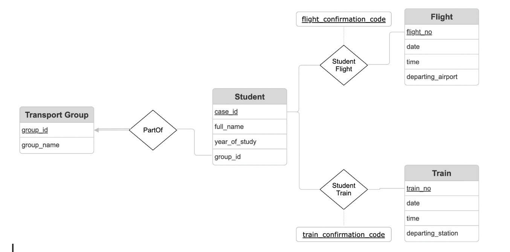

# CSDS 341: Introduction to Database Systems
## Final Project Report

**December 07, 2025**

**Team Members:** Krupa Venkatesan, Menaka Wijeratne, Wiam Skakri

**Project Title:** TravelMatch: Connecting Classmates, One Trip at a Time

---

## 1. Application Background

Throughout a year of college, there are many breaks scattered throughout each semester. Breaks serve as a chance for students to relax for a few days, catch up with family or friends, and take a breath during a difficult semester. For many students, especially those from out of the state, this means making a trip back home, whether that be just an hour's train away or a full day flying across the world.

However, for many students, travel is not seamless. Although booking trains and flights is often straightforward, other parts of the journey are less simple. One of the main aspects of travel that is expensive, risky, and often forgotten about is the ground transportation required to make it to the students' specific port of departure. For many students here at CWRU, a personal vehicle, like a car, is not something that they have access to. Most students opt for ride-booking services such as Uber and Lyft.

This poses two main problems for students, the first of which is safety. When students travel alone or late at night in Ubers or Lyfts, they put themselves at risk. While cases of malicious drivers are rare, they do happen, especially under the circumstances described above. Secondly, there is a huge expense associated with these ride-booking services. Booking a car for 4 for just a single student can be very expensive. Furthermore, Uber and Lyft utilize dynamic pricing, which can lift prices more than 7 times the typical rate during peak travel times, which tend to coincide with student breaks. Thus, ride-booking becomes a huge economic burden for students traveling home.

Current solutions to remedy the problem exist, but are nowhere near sufficient to significantly support CWRU's student body. Uber and Lyft offer ridesharing facilitation, but it is hard to plan groups in advance, and the groups would not be restricted to students. Students currently can use CampusGroups or Sidechat to make public announcements about their plans, but many students shy away from that option due to its publicity and its lack of reliability. The final option is private messaging, where students may text the group chats they are a part of, but this option has limited reach and is not equitable for all students with differently-sized social circles. 

Therefore, we created TravelMatch, a web application that helps CWRU students travel more safely and affordably by matching them in rideshare groups with classmates departing on similar flight or train times. This enables them to coordinate shared rides to where they need to be.

The needs of the application were easily identified. First, we needed a way to register students on the application and enter their personal information. Each student must then be able to enter their flight or train information. The crux of our application was the match page, where students should be able to find other students who are also traveling to similar destinations at the same time, so they can coordinate their travel plans and ride-share. The first important step was to design our database.

---

## 2. Application Requirements Specifications

### 2.1 Functional Requirements

TravelMatch must support the following core functionalities:

1. **Student Registration and Management**
   - Register new students with Case ID, full name, and year of study
   - View all registered students
   - Update student information
   - Delete student records

2. **Flight and Train Information Management**
   - Add flight information (flight number, date, time, departing airport)
   - Add train information (train number, date, time, departing station)
   - Register student bookings for flights and trains using confirmation codes
   - View all flights and trains in the system

3. **Matching System**
   - Find students with similar departure times and locations
   - Match students based on:
     - Same departing airport/station
     - Same departure date
     - Departure times within a reasonable window (e.g., within 2-3 hours)
   - Display potential matches to students

4. **Group Management**
   - Create transport groups for coordinated ridesharing
   - Assign students to existing groups
   - View all groups and their members
   - Manage group membership

5. **Booking Management**
   - View all student bookings (flights and trains)
   - Link students to their transportation bookings
   - Track which students are traveling together


### 2.2 User Interactions

- Students can register themselves in the system
- Students can add their flight or train information
- Students can search for other students with similar travel plans
- Students can create or join transport groups
- Administrators can view all data and manage the system

---

## 3. Database Requirements and Data Model

### 3.1 Data Model Overview

Our database consists of 4 entities and 3 relationships, with 2 of the relationships having their own attributes, resulting in a total of 6 tables. The database is designed to support student registration, flight and train booking management, matching functionality, and group coordination.

### 3.2 Data Objects and Relationships

The database consists of **4 entities** and **3 relationships**:

**Entities:**
1. **Student** - Stores student information (case ID, name, year of study, group membership)
2. **TransportGroup** - Manages rideshare groups
3. **Flight** - Contains flight schedules and departure airports
4. **Train** - Contains train schedules and departure stations

**Relationships:**
1. **PartOf** (Student ↔ TransportGroup) - Links students to their rideshare groups
2. **StudentFlight** (Student ↔ Flight) - Junction table with confirmation codes for flight bookings
3. **StudentTrain** (Student ↔ Train) - Junction table with confirmation codes for train bookings

The matching functionality is built on shared departure locations (same airport/station) and times (same date, similar departure times). Detailed entity attributes and schema specifications are provided in Sections 4 and 7.

### 3.3 Queries and Transactions

The system supports the following queries and transactions:

**Frequent Queries:**
- Find all students registered in the system
- Find all flights/trains on a specific date
- Find students traveling on a specific flight/train
- Find matches for a given student based on departure time and location
- Find all members of a specific transport group

**Transaction Frequencies:**
- Student registration: Moderate (happens at the beginning of each semester/break)
- Adding flight/train information: High (before each break period)
- Finding matches: Very High (primary use case, especially before breaks)
- Group creation and management: Moderate (as students coordinate)
- Viewing bookings: High (students checking their information)

**Complex Queries:**
- Find all students with flights departing from the same airport within X hours of each other
- Find all students with trains departing from the same station on the same day

### 3.4 Events and Actions (Triggers)

The following database events and actions are implemented:
- When a student is deleted, cascade delete their flight and train bookings
- When a flight/train is deleted, cascade delete associated student bookings
- When a group is deleted, set group_id to NULL for all students in that group
- Validate that flight/train dates are not in the past when inserting
- Ensure confirmation codes are unique

### 3.5 Integrity Constraints

**Entity Integrity:**
- Case ID must be unique and not null (primary key)
- Flight number must be unique and not null (primary key)
- Train number must be unique and not null (primary key)
- Group ID must be unique and not null (primary key)
- Confirmation codes must be unique and not null (primary keys)

**Referential Integrity:**
- Student.group_id must reference an existing TransportGroup.group_id or be NULL (ON DELETE SET NULL)
- StudentFlight.case_id must reference an existing Student.case_id (ON DELETE CASCADE)
- StudentFlight.flight_no must reference an existing Flight.flight_no (ON DELETE CASCADE)
- StudentTrain.case_id must reference an existing Student.case_id (ON DELETE CASCADE)
- StudentTrain.train_no must reference an existing Train.train_no (ON DELETE CASCADE)

**Domain Constraints:**
- Year of study must be a positive integer
- Flight/train dates must be valid dates
- Flight/train times must be valid times
- Names and locations must be non-empty strings

**Business Logic Constraints:**
- A student can belong to at most one transport group
- A student can have multiple flight/train bookings
- Confirmation codes must be unique across all bookings

---

## 4. ER Diagram 



**Figure 1: ER Diagram of Database**

Above is the ER diagram of our database. It follows the above data description exactly, with a few exceptions. To adhere to the entity-relationship model, entity Student is connected to TransportGroup via a relationship called PartOf, but this relationship has no attributes. The relationship is one-to-many because one student can only be part of one transport group, the alternative wouldn't make sense. The participation of TransportGroup in PartOf is total, but the participation of Student is partial. Not all student needs to be part of a group, but a transport group only exists if at least one student is in it. The relationships StudentFlight and StudentTrain are exactly the same as described above. Both relationships are many-to-many as we didn't want to oversimplify the situation; it is possible that a student enters many flights or trains for multiple different breaks at the same time, and we wanted to be equipped to handle that. Both StudentFlight and StudentTrain have partial participation on both sides, as not all students need to take a specific mode of transportation, and not all flights or trains need to have students on them.

### 4.1 Entity Details

**Student Entity:**
- **Attributes:**
  - case_id (Primary Key, String, Required)
  - full_name (String, Required)
  - year_of_study (Integer, Optional)
  - group_id (Foreign Key, Integer, Optional)
- **Entity Type:** Strong entity
- **Key:** case_id (simple, single-valued)

**TransportGroup Entity:**
- **Attributes:**
  - group_id (Primary Key, Integer, Auto-increment, Required)
  - group_name (String, Optional)
- **Entity Type:** Strong entity
- **Key:** group_id (simple, single-valued)

**Flight Entity:**
- **Attributes:**
  - flight_no (Primary Key, String, Required)
  - flight_date (Date, Required)
  - flight_time (Time, Required)
  - departing_airport (String, Required)
- **Entity Type:** Strong entity
- **Key:** flight_no (simple, single-valued)

**Train Entity:**
- **Attributes:**
  - train_no (Primary Key, String, Required)
  - train_date (Date, Required)
  - train_time (Time, Required)
  - departing_station (String, Required)
- **Entity Type:** Strong entity
- **Key:** train_no (simple, single-valued)

### 4.2 Relationship Details

**PartOf (Student ↔ TransportGroup):**
- **Type:** One-to-Many (1:N)
- **Cardinality:** One student belongs to at most one group; one group can have many students
- **Participation:**
  - Student: Partial (not all students need to be in a group)
  - TransportGroup: Total (a group must have at least one student)
- **Attributes:** None

**StudentFlight (Student ↔ Flight):**
- **Type:** Many-to-Many (M:N)
- **Cardinality:** A student can have multiple flights; a flight can have multiple students
- **Participation:**
  - Student: Partial (not all students take flights)
  - Flight: Partial (not all flights have students registered)
- **Attributes:**
  - flight_confirmation_code (Primary Key, String, Required)

**StudentTrain (Student ↔ Train):**
- **Type:** Many-to-Many (M:N)
- **Cardinality:** A student can have multiple trains; a train can have multiple students
- **Participation:**
  - Student: Partial (not all students take trains)
  - Train: Partial (not all trains have students registered)
- **Attributes:**
  - train_confirmation_code (Primary Key, String, Required)

---

## 5. Transforming ER Model to Relational Model 

### 5.1 Entity-to-Relation Mapping

Each entity in the ER model maps directly to a relation:

1. **Student Entity → Student Relation**
   - All attributes become columns
   - Primary key: case_id
   - Foreign key: group_id references TransportGroup(group_id)

2. **TransportGroup Entity → TransportGroup Relation**
   - All attributes become columns
   - Primary key: group_id

3. **Flight Entity → Flight Relation**
   - All attributes become columns
   - Primary key: flight_no

4. **Train Entity → Train Relation**
   - All attributes become columns
   - Primary key: train_no

### 5.2 Relationship-to-Relation Mapping

**PartOf Relationship:**
- Since it's a 1:N relationship with no attributes, the foreign key is embedded in the Student relation (group_id)
- No separate relation needed

**StudentFlight Relationship:**
- Since it's M:N with attributes, it becomes a separate relation
- Primary key: flight_confirmation_code
- Foreign keys: case_id (references Student), flight_no (references Flight)

**StudentTrain Relationship:**
- Since it's M:N with attributes, it becomes a separate relation
- Primary key: train_confirmation_code
- Foreign keys: case_id (references Student), train_no (references Train)

### 5.3 Integrity Constraints in Relational Model

All integrity constraints defined in Section 3.5 are enforced in the relational model through:
- **Entity Integrity:** PRIMARY KEY constraints ensure all primary keys are NOT NULL and UNIQUE
- **Referential Integrity:** FOREIGN KEY declarations with CASCADE/SET NULL actions (see Section 3.5 for details)
- **Domain Constraints:** Data type specifications in table definitions
- **Business Logic:** Enforced through foreign key relationships and application logic

---

## 6. Functional Dependencies

Based on the semantics of our data, we have identified the following functional dependencies:

### 6.1 Functional Dependencies by Relation

**Student Relation:**
- case_id → full_name, year_of_study, group_id
  - *Explanation:* Case ID uniquely identifies a student and determines all their attributes

**TransportGroup Relation:**
- group_id → group_name
  - *Explanation:* Group ID uniquely identifies a group and determines its name

**Flight Relation:**
- flight_no → flight_date, flight_time, departing_airport
  - *Explanation:* Flight number uniquely identifies a flight and determines its schedule and departure location

**Train Relation:**
- train_no → train_date, train_time, departing_station
  - *Explanation:* Train number uniquely identifies a train and determines its schedule and departure location

**StudentFlight Relation:**
- flight_confirmation_code → case_id, flight_no
  - *Explanation:* Confirmation code uniquely identifies a booking and determines which student and flight it belongs to

**StudentTrain Relation:**
- train_confirmation_code → case_id, train_no
  - *Explanation:* Confirmation code uniquely identifies a booking and determines which student and train it belongs to

**Note:** All functional dependencies listed above are already minimal. There are no redundant attributes on the right-hand side, and no FDs can be derived from others.

---

## 7. Database Schema

### 7.1 Schema Overview

Our database schema consists of 6 tables, all of which satisfy Third Normal Form (3NF). The schema is designed to eliminate redundancy and maintain data integrity.

### 7.2 Table Definitions

**TransportGroup:**
- group_id (INT, PRIMARY KEY, AUTO_INCREMENT)
- group_name (VARCHAR(100))

**Flight:**
- flight_no (VARCHAR(20), PRIMARY KEY)
- flight_date (DATE, NOT NULL)
- flight_time (TIME, NOT NULL)
- departing_airport (VARCHAR(100), NOT NULL)

**Train:**
- train_no (VARCHAR(20), PRIMARY KEY)
- train_date (DATE, NOT NULL)
- train_time (TIME, NOT NULL)
- departing_station (VARCHAR(100), NOT NULL)

**Student:**
- case_id (VARCHAR(50), PRIMARY KEY)
- full_name (VARCHAR(100), NOT NULL)
- year_of_study (INT)
- group_id (INT, FOREIGN KEY REFERENCES TransportGroup(group_id) ON DELETE SET NULL)

**StudentFlight:**
- flight_confirmation_code (VARCHAR(50), PRIMARY KEY)
- case_id (VARCHAR(50), NOT NULL, FOREIGN KEY REFERENCES Student(case_id) ON DELETE CASCADE)
- flight_no (VARCHAR(20), NOT NULL, FOREIGN KEY REFERENCES Flight(flight_no) ON DELETE CASCADE)

**StudentTrain:**
- train_confirmation_code (VARCHAR(50), PRIMARY KEY)
- case_id (VARCHAR(50), NOT NULL, FOREIGN KEY REFERENCES Student(case_id) ON DELETE CASCADE)
- train_no (VARCHAR(20), NOT NULL, FOREIGN KEY REFERENCES Train(train_no) ON DELETE CASCADE)

### 7.3 Normalization Analysis

All relations are in **Third Normal Form (3NF)**:

- Each relation has a single primary key
- All non-key attributes are functionally dependent on the primary key
- There are no transitive dependencies (non-key attributes depend only on the primary key, not on other non-key attributes)
- All relations are also in **Boyce-Codd Normal Form (BCNF)** since every determinant is a candidate key

---

## 8. Creating Your Database

### 8.1 DBMS Selection

We selected **MySQL** as our database management system. MySQL is a widely-used, open-source relational database management system that provides excellent performance, reliability, and ease of use. It supports all the features we need including foreign keys, cascading deletes, and various data types.

### 8.2 Installation and Setup

MySQL was installed locally on macOS. The installation process was straightforward using Homebrew package manager. We encountered minimal issues during installation, primarily related to ensuring the MySQL service was running and accessible.

### 8.3 Database Schema Creation

The database schema was created using SQL DDL commands. We used MySQL Workbench as a GUI interface to visualize and manage the database structure. The actual CREATE TABLE commands are shown below:

```sql
CREATE DATABASE IF NOT EXISTS travel_match;
USE travel_match;

-- TransportGroup table - for grouping students
CREATE TABLE IF NOT EXISTS TransportGroup (
    group_id INT AUTO_INCREMENT,
    group_name VARCHAR(100),
    PRIMARY KEY (group_id)
);

-- Flight table - stores flight information
CREATE TABLE IF NOT EXISTS Flight (
    flight_no VARCHAR(20),
    flight_date DATE NOT NULL,
    flight_time TIME NOT NULL,
    departing_airport VARCHAR(100) NOT NULL,
    PRIMARY KEY (flight_no)
);

-- Train table - stores train information
CREATE TABLE IF NOT EXISTS Train (
    train_no VARCHAR(20),
    train_date DATE NOT NULL,
    train_time TIME NOT NULL,
    departing_station VARCHAR(100) NOT NULL,
    PRIMARY KEY (train_no)
);

-- Student table - stores student information
CREATE TABLE IF NOT EXISTS Student (
    case_id VARCHAR(50),
    full_name VARCHAR(100) NOT NULL,
    year_of_study INT,
    group_id INT NULL,
    PRIMARY KEY (case_id),
    FOREIGN KEY (group_id) REFERENCES TransportGroup(group_id) ON DELETE SET NULL
);

-- StudentFlight junction table - links students to flights
CREATE TABLE IF NOT EXISTS StudentFlight (
    flight_confirmation_code VARCHAR(50),
    case_id VARCHAR(50) NOT NULL,
    flight_no VARCHAR(20) NOT NULL,
    PRIMARY KEY (flight_confirmation_code),
    FOREIGN KEY (case_id) REFERENCES Student(case_id) ON DELETE CASCADE,
    FOREIGN KEY (flight_no) REFERENCES Flight(flight_no) ON DELETE CASCADE
);

-- StudentTrain junction table - links students to trains
CREATE TABLE IF NOT EXISTS StudentTrain (
    train_confirmation_code VARCHAR(50),
    case_id VARCHAR(50) NOT NULL,
    train_no VARCHAR(20) NOT NULL,
    PRIMARY KEY (train_confirmation_code),
    FOREIGN KEY (case_id) REFERENCES Student(case_id) ON DELETE CASCADE,
    FOREIGN KEY (train_no) REFERENCES Train(train_no) ON DELETE CASCADE
);
```

---

## 9. Example SQL Queries and Relational Algebra

### 9.1 Query 1: Find All Students

**English:** Retrieve all students registered in the system with their names and year of study.

**SQL:**
```sql
SELECT case_id, full_name, year_of_study
FROM Student;
```

**Relational Algebra:**
```
π case_id, full_name, year_of_study (Student)
```

### 9.2 Query 2: Find Students with Flights on a Specific Date

**English:** Find all students who have flights departing on December 15, 2025, along with their flight details.

**SQL:**
```sql
SELECT s.case_id, s.full_name, f.flight_no, f.flight_time, f.departing_airport
FROM Student s
JOIN StudentFlight sf ON s.case_id = sf.case_id
JOIN Flight f ON sf.flight_no = f.flight_no
WHERE f.flight_date = '2025-12-15';
```

**Relational Algebra:**
```
π case_id, full_name, flight_no, flight_time, departing_airport (
  σ flight_date = '2025-12-15' (
    Student ⨝ StudentFlight ⨝ Flight
  )
)
```

### 9.3 Query 3: Find All Students in a Group

**English:** Retrieve all students who belong to a specific transport group, along with the group name.

**SQL:**
```sql
SELECT s.case_id, s.full_name, tg.group_name
FROM Student s
JOIN TransportGroup tg ON s.group_id = tg.group_id
WHERE tg.group_id = 1;
```

**Relational Algebra:**
```
π case_id, full_name, group_name (
  σ group_id = 1 (
    Student ⨝ TransportGroup
  )
)
```

---

## 10. Application Implementation

### 10.1 Technology Stack

**Backend:**
- Python 3.x
- Flask (web framework)
- MySQL Connector (database driver)

**Frontend:**
- React.js
- Vite (build tool)
- Tailwind CSS (styling)

**Database:**
- MySQL 8.0+

**Operating System:**
- macOS (development environment)

### 10.2 Command-Line Interface

We implemented a command-line interface using Python that allows database operations from outside the database command line. The CLI provides:

- Student registration and viewing
- Flight/train addition
- Booking management
- Match finding
- Group management

### 10.3 Web-Based User Interface

The web interface is implemented using React.js with the following pages:

1. **Home Page:** Overview and navigation
2. **Students Page:** Add and view students
3. **Bookings Page:** Manage flights, trains, and student bookings
4. **Find Matches Page:** Search for matching students
5. **Groups Page:** Create and manage transport groups

**Features:**
- Modern, responsive design
- RESTful API integration
- Real-time data updates
- Form validation
- Error handling


---

## 11. Team Member Roles and Contributions

### 11.1 Team Member Contributions

**Menaka Wijeratne:**
- *Role:* Database Design and Requirements Development
- *Contributions:*
  - Responsible for background research to justify the need for the decided-upon solution
  - Development of requirements
  - Responsible for database design and ER diagram creation
  - Created the database, table definitions, and relationships for the backbone of the project
- *Independent Work:* Background research, requirements specification, database design, ER diagram creation, table definitions

**Krupa Venkatesan:**
- *Role:* Database Automation and CLI Development
- *Contributions:*
  - Automated creation of the database
  - Created the necessary functions to interact with the database via SQL (used by the CLI + web app)
  - Created a CLI (Command-Line Interface) to create the ridesharing system
- *Independent Work:* Database automation, SQL function development, CLI implementation

**Wiam Skakri:**
- *Role:* Full-Stack Web Application Development
- *Contributions:*
  - Built a React web application with multiple pages
  - Developed a Flask REST API backend with endpoints for student management, bookings, and rideshare matching
  - Integrated the frontend with the MySQL database through API calls for real-time data operations
  - Implemented the database operations layer connecting the Flask API to MySQL for queries and data management
- *Independent Work:* React frontend development, Flask backend API development, frontend-backend integration, database operations layer

### 11.2 What We Learned

**Menaka Wijeratne:**
"I realized the power of data through this project. Honestly, this is a problem I myself have struggled with for semesters on end. The fact that this class project enabled me to take action on a problem that gives me so much grief was an eye opener. I'm glad we got assigned this project because I've learned so much, and that problems don't need to be unsolvable. If you take a methodical approach and design your database correctly, any analysis can be made simple."

**Krupa Venkatesan:**
"This project was reflective of the importance of proper data storage and organization methods. Working through the different scenarios of use cases revealed inconsistencies in our data organization methods and indicated how the data would not be representative of the true situation. As a result of this project, I have learned the importance of normalization, functional dependencies, and designing schemas that enforce real-world constraints."

**Wiam Skakri:**
"This project showed me how proper database design solves real problems. Building the Student Rideshare Match application, I learned that normalization, foreign keys, and junction tables aren't just concepts, they're tools that make complex matching possible. The experience reinforced that thoughtful schema design and methodical planning can address genuine student needs."

---

## 12. Conclusions

TravelMatch successfully addresses the problem of expensive and unsafe ground transportation for CWRU students traveling during breaks. Through careful database design, normalization, and implementation, we created a system that allows students to find rideshare matches efficiently.

**Key Achievements:**
- Designed a normalized database schema (BCNF) with 6 tables
- Implemented both command-line and web-based interfaces
- Created a functional matching system for students
- Ensured data integrity through proper constraints and normalization

**Future Enhancements:**
- Real-time notifications for matches
- Integration with external flight/train APIs
- Mobile application
- Advanced matching algorithms considering preferences
- Rating and review system for groups


